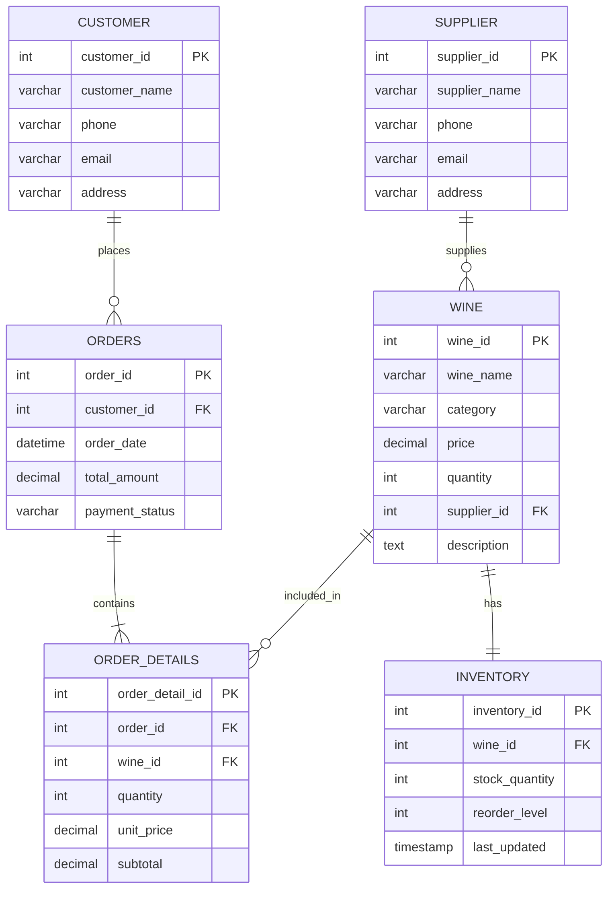

# WINES MANAGEMENT SYSTEM
### A Full-Stack Academic Database Systems Engineering Project

---

## Academic Project Details
* **Project Title:** WINES MANAGEMENT SYSTEM
* **Course:** B.Tech Database Systems Engineering / DBMS
* **Project Team:**
  * **S VENUGOPAL**
  * **V PAVAN KUMAR**
  * **ABHISHEK YADAV**
* **Team Number:** 19
* **Section:** 3
* **Academic Year:** 2025–2026

---

## 1. Abstract
The **Wines Management System** is an enterprise-grade full-stack database application designed to demonstrate essential Database Management System (DBMS) principles, including Entity-Relationship (ER) modeling, Third Normal Form (3NF) relational database design, declarative constraint enforcement, B-Tree performance indexing, ACID transactional execution, stored routines, database triggers, analytical views, and CSV bulk import/export capabilities. 

Built with a **Python Flask** REST API backend, **MySQL 8.x** relational engine, and an elegant **HTML5/CSS3/Vanilla JavaScript** frontend, the system eliminates data redundancy, prevents insertion, update, and deletion anomalies, and enforces real-time stock integrity during sales order transactions.

---

## 2. Problem Statement
Traditional retail wine store inventory and sales management often suffer from:
1. **Data Redundancy & Inconsistency:** Duplicate customer and supplier records across spreadsheets causing discrepancy in contact and tax identifiers.
2. **Stock Discrepancies & Negative Inventory:** Concurrent sales orders deducting stock without transactional isolation, allowing inventory to fall below zero.
3. **Lack of Referential Integrity:** Accidental deletion of suppliers or wines while active sales orders reference them, leading to orphan records.
4. **Slow Analytical Reporting:** Unindexed queries causing slow generation of low-stock reorder warnings, sales velocity by category, and supplier portfolio audits.

---

## 3. Project Objectives
1. Design and implement a fully normalized (3NF) relational database schema for six core entities: `supplier`, `wine`, `customer`, `orders`, `order_details`, and `inventory`.
2. Guarantee **ACID transactions** (Atomicity, Consistency, Isolation, Durability) during multi-item sales order placement and inventory stock additions/removals.
3. Provide declarative referential integrity constraints (`ON UPDATE CASCADE`, `ON DELETE RESTRICT`, `ON DELETE CASCADE`) to prevent orphaned rows.
4. Deliver high-performance RESTful APIs supporting full CRUD operations, multi-column search, dynamic sorting, and server-side filtering.
5. Implement RFC 4180 compliant CSV bulk upload parsers with row-by-row validation feedback and one-click streaming CSV exports.
6. Provide an interactive responsive dashboard with Chart.js visual analytics and a dedicated SQL Data Center for MySQL Workbench migration.

---

## 4. Technology Stack

| Layer | Technologies & Tools |
| :--- | :--- |
| **Frontend** | HTML5, CSS3 (Wine & Burgundy Theme, CSS Variables), Modern Vanilla JavaScript (ES6+), Bootstrap 5.3.3, Chart.js, Bootstrap Icons |
| **Backend** | Python 3.10+, Flask, Flask-CORS, mysql-connector-python, python-dotenv |
| **Database** | MySQL 8.x Community Server / MySQL Workbench (`wines_management_db`) with automated offline SQLite3 test fallback |
| **Modeling & Diagrams** | Mermaid.js, Draw.io (diagrams.net), MySQL Workbench Reverse Engineering |
| **Data Formats** | REST JSON, RFC 4180 CSV, MySQL DDL/DML SQL scripts |

---

## 5. System Architecture

```
                  ┌─────────────────────────────────────────┐
                  │          Web Browser Client             │
                  │   HTML5 / CSS3 / Vanilla JS / Chart.js  │
                  └────────────────────┬────────────────────┘
                                       │ HTTP Requests (JSON / Form Data)
                                       │ HTTP Responses (JSON / CSV Streams)
                                       ▼
                  ┌─────────────────────────────────────────┐
                  │       Flask Backend REST API            │
                  │  ├── routes/ (Wine, Cust, Sup, Inv, Ord)│
                  │  ├── utils/  (CSV Parser, SQL Exporter) │
                  │  └── db.py   (Connection Pool & Driver) │
                  └────────────────────┬────────────────────┘
                                       │ Parameterized SQL (%s)
                                       │ Multi-Statement ACID Transactions
                                       ▼
                  ┌─────────────────────────────────────────┐
                  │       MySQL 8.x Relational Engine       │
                  │        (wines_management_db)            │
                  │  ├── 6 Relational Tables (PK, FK, CHECK)│
                  │  ├── 5 Relational Analytical Views      │
                  │  ├── 5 Stored Procedures                │
                  │  ├── 3 ACID Integrity Triggers          │
                  │  └── 10 Performance B-Tree Indexes      │
                  └─────────────────────────────────────────┘
```

---

## 6. Database Relational Design (6 Core Tables)

The database `wines_management_db` is composed of 6 normalized relational tables:

```
+----------------+          +-------------------+          +-------------------+
|    SUPPLIER    | 1 ---- M |       WINE        | 1 ---- 1 |     INVENTORY     |
+----------------+          +-------------------+          +-------------------+
                                      | 1
                                      |
                                      | M
+----------------+          +-------------------+
|    CUSTOMER    | 1 ---- M |      ORDERS       |
+----------------+          +-------------------+
                                      | 1
                                      |
                                      | M
                            +-------------------+
                            |   ORDER_DETAILS   |
                            +-------------------+
```

### Table 1: `supplier`
* **Purpose:** Stores estate vineyards, distributors, and licensed wineries.
* **Schema:**
  * `supplier_id` INT PRIMARY KEY AUTO_INCREMENT
  * `supplier_name` VARCHAR(100) NOT NULL
  * `phone` VARCHAR(20)
  * `email` VARCHAR(100)
  * `address` VARCHAR(255)
  * `created_at` TIMESTAMP DEFAULT CURRENT_TIMESTAMP

### Table 2: `wine`
* **Purpose:** Stores wine varieties, tasting categories, base prices, quantities, and supplier associations.
* **Schema:**
  * `wine_id` INT PRIMARY KEY AUTO_INCREMENT
  * `wine_name` VARCHAR(100) NOT NULL
  * `category` VARCHAR(50) NOT NULL
  * `price` DECIMAL(10,2) NOT NULL
  * `quantity` INT DEFAULT 0
  * `supplier_id` INT NOT NULL
  * `description` TEXT
  * `created_at` TIMESTAMP DEFAULT CURRENT_TIMESTAMP
  * `FOREIGN KEY (supplier_id) REFERENCES supplier(supplier_id) ON UPDATE CASCADE ON DELETE RESTRICT`

### Table 3: `customer`
* **Purpose:** Stores registered customers, corporate patrons, and restaurant buyers.
* **Schema:**
  * `customer_id` INT PRIMARY KEY AUTO_INCREMENT
  * `customer_name` VARCHAR(100) NOT NULL
  * `phone` VARCHAR(20)
  * `email` VARCHAR(100)
  * `address` VARCHAR(255)
  * `created_at` TIMESTAMP DEFAULT CURRENT_TIMESTAMP

### Table 4: `orders`
* **Purpose:** Stores customer sales order headers, order timestamps, grand totals, and payment states.
* **Schema:**
  * `order_id` INT PRIMARY KEY AUTO_INCREMENT
  * `customer_id` INT NOT NULL
  * `order_date` DATETIME DEFAULT CURRENT_TIMESTAMP
  * `total_amount` DECIMAL(12,2) DEFAULT 0.00
  * `payment_status` VARCHAR(30) DEFAULT 'Pending'
  * `FOREIGN KEY (customer_id) REFERENCES customer(customer_id) ON UPDATE CASCADE ON DELETE RESTRICT`

### Table 5: `order_details`
* **Purpose:** Bridge entity resolving M:N relationship between `orders` and `wine`. Implements a generated stored column for line subtotals.
* **Schema:**
  * `order_detail_id` INT PRIMARY KEY AUTO_INCREMENT
  * `order_id` INT NOT NULL
  * `wine_id` INT NOT NULL
  * `quantity` INT NOT NULL
  * `unit_price` DECIMAL(10,2) NOT NULL
  * `subtotal` DECIMAL(12,2) GENERATED ALWAYS AS (quantity * unit_price) STORED
  * `FOREIGN KEY (order_id) REFERENCES orders(order_id) ON DELETE CASCADE`
  * `FOREIGN KEY (wine_id) REFERENCES wine(wine_id) ON DELETE RESTRICT`

### Table 6: `inventory`
* **Purpose:** Tracks physical warehouse stock quantities, reorder thresholds, and audit timestamps.
* **Schema:**
  * `inventory_id` INT PRIMARY KEY AUTO_INCREMENT
  * `wine_id` INT NOT NULL UNIQUE
  * `stock_quantity` INT DEFAULT 0
  * `reorder_level` INT DEFAULT 10
  * `last_updated` TIMESTAMP DEFAULT CURRENT_TIMESTAMP ON UPDATE CURRENT_TIMESTAMP
  * `FOREIGN KEY (wine_id) REFERENCES wine(wine_id) ON DELETE CASCADE`

---

## 7. Entity Relationship (ER) Diagram

### Mermaid ER Code (`diagrams/er_diagram.mmd`)


### How to Import into Draw.io (diagrams.net)
1. Navigate to [app.diagrams.net](https://app.diagrams.net/).
2. Select **Create New Diagram** &rarr; **Blank Diagram**.
3. In the top toolbar, click **Arrange &rarr; Insert &rarr; Advanced &rarr; Mermaid**.
4. Paste the Mermaid code above into the dialog box.
5. Click **Insert**. Draw.io will automatically layout the Crow's foot relational diagram.
6. Export as high-resolution PNG or vector PDF via **File &rarr; Export as**.

---

## 8. Database Normalization (1NF, 2NF, 3NF Analysis)

### First Normal Form (1NF)
* **Definition:** Each column contains only atomic (indivisible) values, and each record is uniquely identifiable by a primary key.
* **Application in Project:**
  * No multi-valued attributes exist (e.g. multiple phone numbers or ordered wines are never stored in a comma-separated column).
  * Every table has an explicit, surrogate single-column primary key (`supplier_id`, `wine_id`, `customer_id`, etc.).

### Second Normal Form (2NF)
* **Definition:** The relation is in 1NF and contains no **partial functional dependencies** (no non-prime attribute is dependent on a proper subset of any candidate key).
* **Application in Project:**
  * All non-key attributes depend entirely on the whole primary key. In `order_details`, the composite relationship `(order_id, wine_id)` uses a dedicated surrogate key `order_detail_id`.
  * Wine descriptions and category details depend strictly on `wine_id`, not on the order.

### Third Normal Form (3NF)
* **Definition:** The relation is in 2NF and contains no **transitive functional dependencies** (no non-prime attribute depends on another non-prime attribute; for every functional dependency $X \rightarrow Y$, either $X$ is a superkey or $Y$ is a prime attribute).
* **Application in Project:**
  * Customer name, phone, and address are stored exclusively in the `customer` table. The `orders` table only retains foreign key `customer_id`. Updating a customer's address in `customer` immediately reflects across all historical orders without modification anomalies.
  * Supplier name, phone, and address are stored exclusively in `supplier`, not replicated inside `wine`.
  * `inventory` is partitioned from `wine` with a 1-to-1 unique foreign key, separating transactional stock status auditing from static catalog descriptions.

### Elimination of Database Anomalies
1. **Insertion Anomaly:** A new supplier can be registered before any wines are produced by that supplier.
2. **Update Anomaly:** Updating a supplier's contact email or phone requires updating exactly one row in `supplier`.
3. **Deletion Anomaly:** Deleting an order removes lines in `order_details` (via `CASCADE`), but leaves the `wine` and `customer` records intact.

---

## 9. Transactions & ACID Properties

All sales orders and inventory adjustments are wrapped within MySQL ACID transactions (`database/08_transactions.sql`).

```sql
START TRANSACTION;

-- 1. Insert order record
INSERT INTO orders (customer_id, total_amount, payment_status)
VALUES (1, 3700.00, 'Paid');
SET @new_order_id = LAST_INSERT_ID();

-- 2. Insert order details (subtotal is computed automatically)
INSERT INTO order_details (order_id, wine_id, quantity, unit_price)
VALUES (@new_order_id, 1, 2, 1850.00);

-- 3. Atomically decrement stock
UPDATE inventory SET stock_quantity = stock_quantity - 2 WHERE wine_id = 1;
UPDATE wine SET quantity = quantity - 2 WHERE wine_id = 1;

COMMIT;
```

### The Four ACID Properties:
* **Atomicity:** Either all statements (order header, order details, inventory reduction, wine quantity reduction) succeed, or the entire operation is rolled back using `ROLLBACK`.
* **Consistency:** Stock quantities can never drop below zero. Foreign key constraints guarantee only valid customers and wines are referenced.
* **Isolation:** The Repeatable Read transaction isolation level in InnoDB prevents dirty reads and non-repeatable reads during concurrent checkouts.
* **Durability:** Committed transactions are flushed to the InnoDB write-ahead log (`ib_logfile`), ensuring state persistence across system crashes or power outages.

---

## 10. Database Scripts Organization (`database/`)

| Script | Purpose & Description |
| :--- | :--- |
| `01_create_database.sql` | Creates database `wines_management_db` with UTF-8mb4 collation. |
| `02_create_tables.sql` | DDL for all 6 tables with constraints, stored generated columns, and indexes. |
| `03_insert_sample_data.sql` | Seed scripts for 25 suppliers, 50 wines, 250 customers, 50 inventory, 100 orders, 264 order details. |
| `04_queries.sql` | 12+ queries demonstrating `SELECT`, `JOIN`, `GROUP BY`, `HAVING`, `SUM`, `COUNT`, `AVG`. |
| `05_views.sql` | 5 relational views (`available_stock_view`, `low_stock_view`, `customer_order_history_view`, etc.). |
| `06_procedures.sql` | 5 stored procedures (`add_stock`, `remove_stock`, `get_customer_orders`, `get_low_stock`, `get_total_sales`). |
| `07_triggers.sql` | 3 triggers enforcing positive inventory and synchronizing order totals. |
| `08_transactions.sql` | Demonstrates ACID transaction syntax, commit, rollback, and savepoints. |
| `09_export.sql` | Workbench and command-line instructions for exporting database snapshots. |
| `complete_database.sql` | **Single unified 67KB deployment script** containing schema, seeds, views, procedures, and triggers. |

---

## 11. REST API Endpoints Reference

### Customers (`/api/customers`)
* `GET /api/customers` - List customers with search, sorting, and pagination.
* `GET /api/customers/<id>` - Retrieve customer by ID.
* `POST /api/customers` - Add new customer.
* `PUT /api/customers/<id>` - Update existing customer.
* `DELETE /api/customers/<id>` - Safe delete (blocked if customer has orders).
* `POST /api/customers/import` - CSV batch upload.
* `GET /api/customers/export` - RFC 4180 CSV export.

### Wines (`/api/wines`)
* `GET /api/wines` - List wines with category filter, price/stock sort, and search.
* `GET /api/wines/<id>` - Retrieve wine with real-time stock levels.
* `POST /api/wines` - Add wine & auto-initialize inventory stock record.
* `PUT /api/wines/<id>` - Update wine catalog record & sync stock.
* `DELETE /api/wines/<id>` - Safe delete (blocked if wine has order history).
* `POST /api/wines/import` - CSV batch upload.
* `GET /api/wines/export` - RFC 4180 CSV export.

### Suppliers (`/api/suppliers`)
* `GET /api/suppliers` - List suppliers with wine variety counts.
* `GET /api/suppliers/<id>` - Retrieve supplier profile.
* `POST /api/suppliers` - Add supplier.
* `PUT /api/suppliers/<id>` - Update supplier details.
* `DELETE /api/suppliers/<id>` - Safe delete (blocked if supplier has wines linked).
* `POST /api/suppliers/import` - CSV batch upload.
* `GET /api/suppliers/export` - RFC 4180 CSV export.

### Inventory (`/api/inventory`)
* `GET /api/inventory` - List inventory with dynamic status (`IN STOCK`, `LOW STOCK`, `OUT OF STOCK`).
* `POST /api/inventory/add` - Transactional stock addition.
* `POST /api/inventory/remove` - Transactional stock deduction (prevents negative stock).
* `PUT /api/inventory/<id>` - Update stock quantity and reorder threshold.
* `DELETE /api/inventory/<id>` - Delete inventory line.
* `POST /api/inventory/import` - Bulk reconciliation CSV upload.
* `GET /api/inventory/export` - CSV export.

### Orders (`/api/orders`)
* `GET /api/orders` - List customer orders with total amounts and payment statuses.
* `GET /api/orders/<id>` - Retrieve order header and line items.
* `POST /api/orders` - Place multi-item order with ACID transaction & stock deduction.
* `PUT /api/orders/<id>` - Update payment status (`Pending`, `Paid`, `Cancelled`).
* `DELETE /api/orders/<id>` - Cancel/delete order (cascades order details).
* `GET /api/orders/export` - Orders CSV export.
* `GET /api/order-details/export` - Detailed line-item breakdown CSV export.

### Dashboard & Analytical Reports (`/api/dashboard`, `/api/reports`)
* `GET /api/dashboard` - Returns 8 core metrics, category distribution, and top 5 wines.
* `GET /api/reports/available-stock` - All in-stock products.
* `GET /api/reports/low-stock` - Products needing reorder ($stock \le threshold$).
* `GET /api/reports/out-of-stock` - Products with 0 bottles in warehouse.
* `GET /api/reports/customer-history` - Order history grouped by customer.
* `GET /api/reports/sales` - Sales breakdown by payment status and AOV.
* `GET /api/reports/sales-by-date` - Daily sales volume and gross revenue.
* `GET /api/reports/sales-by-wine` - Performance by wine SKU.
* `GET /api/reports/sales-by-category` - Category performance breakdown.
* `GET /api/reports/supplier-wines` - Supplier portfolios and stock levels.
* `GET /api/reports/top-wines` - Top selling wines ranked by volume.
* `GET /api/reports/export/<report_name>` - Stream any report directly as CSV.

### SQL Workbench Data Downloads (`/api/sql`)
* `GET /api/sql/complete` - Download `complete_database.sql`.
* `GET /api/sql/schema` - Download table DDL `02_create_tables.sql`.
* `GET /api/sql/sample-data` - Download seed data `03_insert_sample_data.sql`.
* `GET /api/sql/customers` - Dynamic `INSERT INTO customer` dump.
* `GET /api/sql/wines` - Dynamic `INSERT INTO wine` dump.
* `GET /api/sql/suppliers` - Dynamic `INSERT INTO supplier` dump.
* `GET /api/sql/inventory` - Dynamic `INSERT INTO inventory` dump.
* `GET /api/sql/orders` - Dynamic `INSERT INTO orders` dump.
* `GET /api/sql/order-details` - Dynamic `INSERT INTO order_details` dump.

---

## 12. Installation & Run Guide (Windows / VS Code)

### Step 1: Verify Python Installation
Open PowerShell or Command Prompt:
```powershell
python --version
```
Ensure Python 3.10+ is installed.

### Step 2: Navigate to Project Folder
```powershell
cd c:\Users\sadam\OneDrive\Desktop\DBMS\PRO\wines-management-system
```

### Step 3: Create & Activate Virtual Environment
```powershell
python -m venv venv
venv\Scripts\activate
```

### Step 4: Install Dependencies
```powershell
pip install -r backend/requirements.txt
```

### Step 5: Start MySQL Server
Ensure the MySQL service is running:
```powershell
net start MySQL80
```

### Step 6: Import Database into MySQL
Log into MySQL CLI:
```powershell
mysql -u root -p
```
Enter your password, then execute:
```sql
SOURCE C:/Users/sadam/OneDrive/Desktop/DBMS/PRO/wines-management-system/database/complete_database.sql;
```
*(Note: Always use forward slashes `/` in the MySQL SOURCE command path).*

**Alternatively in MySQL Workbench:**
1. Open MySQL Workbench and connect to `localhost:3306`.
2. Go to **File &rarr; Open SQL Script...**
3. Select `database/complete_database.sql`.
4. Click the **Execute (Lightning Bolt)** button.

### Step 7: Configure Environment Credentials
Copy `.env.example` to `.env`:
```powershell
copy .env.example .env
```
Edit `.env` with your MySQL credentials:
```ini
DB_HOST=localhost
DB_PORT=3306
DB_USER=root
DB_PASSWORD=YOUR_MYSQL_PASSWORD
DB_NAME=wines_management_db
SERVER_PORT=5000
```

### Step 8: Start the Flask Application
```powershell
python backend/app.py
```

### Step 9: Open the Web Application
Open your web browser and navigate to:
```
http://127.0.0.1:5000
```
The entire application (dashboard, pages, APIs, and data downloads) is served directly from this URL.

---

## 13. MySQL CSV Bulk Import Commands (`LOAD DATA LOCAL INFILE`)

To import datasets directly in MySQL CLI or Workbench:

```sql
USE wines_management_db;

-- 1. Enable local infile if needed
SET GLOBAL local_infile = 1;

-- 2. Import Customers (250 synthetic records)
LOAD DATA LOCAL INFILE 'C:/Users/sadam/OneDrive/Desktop/DBMS/PRO/wines-management-system/data/customers.csv'
INTO TABLE customer
FIELDS TERMINATED BY ','
ENCLOSED BY '"'
LINES TERMINATED BY '\n'
IGNORE 1 ROWS
(customer_name, phone, email, address);

-- 3. Import Suppliers
LOAD DATA LOCAL INFILE 'C:/Users/sadam/OneDrive/Desktop/DBMS/PRO/wines-management-system/data/suppliers.csv'
INTO TABLE supplier
FIELDS TERMINATED BY ','
ENCLOSED BY '"'
LINES TERMINATED BY '\n'
IGNORE 1 ROWS
(supplier_name, phone, email, address);

-- 4. Import Wines
LOAD DATA LOCAL INFILE 'C:/Users/sadam/OneDrive/Desktop/DBMS/PRO/wines-management-system/data/wines.csv'
INTO TABLE wine
FIELDS TERMINATED BY ','
ENCLOSED BY '"'
LINES TERMINATED BY '\n'
IGNORE 1 ROWS
(wine_name, category, price, quantity, supplier_id, description);

-- 5. Import Inventory
LOAD DATA LOCAL INFILE 'C:/Users/sadam/OneDrive/Desktop/DBMS/PRO/wines-management-system/data/inventory.csv'
INTO TABLE inventory
FIELDS TERMINATED BY ','
ENCLOSED BY '"'
LINES TERMINATED BY '\n'
IGNORE 1 ROWS
(wine_id, stock_quantity, reorder_level);
```

---

## 14. Automated Testing & Verification

An automated verification suite is included in `backend/test_system.py`. To run all 35 tests:

```powershell
python backend/test_system.py
```

### Verification Checklist (35 Automated Tests):
* [x] **Database Connectivity & Health Check**
* [x] **Real-time Dashboard Metrics Aggregation**
* [x] **Customer CRUD:** Create, Read, Update, and Safe Delete Check
* [x] **Supplier CRUD:** Create, Read, Update, and Block Deletion if Wines Linked
* [x] **Wine CRUD:** Create with Auto-Inventory Sync, Update, and Block if Ordered
* [x] **Inventory Stock Addition:** Transactional update to both `wine` and `inventory`
* [x] **Inventory Stock Deduction:** Transactional decrease and Insufficient Stock prevention
* [x] **Order Placement:** Multi-item ACID transaction with automatic inventory decrement
* [x] **Foreign Key Cascade:** Deleting order cascades to `order_details`
* [x] **CSV Exports:** Customers, Wines, Suppliers, Inventory, Orders, Order Details
* [x] **CSV Imports:** Batch upload with field validation and row error reporting
* [x] **10 Analytical DBMS Reports:** Available stock, low stock, sales by date/wine/category
* [x] **SQL Downloads:** Complete database, schema, seed data, and dynamic table dumps
* [x] **Frontend Static Serving:** All HTML, CSS, and JS controllers load with HTTP 200

---

## 15. Presentation Guide (For B.Tech DBMS Viva)

### Key Demonstration Steps During Viva:
1. **Show Dashboard:** Demonstrate real-time KPI metrics (`total_wines`, `total_stock`, `low_stock_count`, `total_sales`) fetched live from MySQL.
2. **Demonstrate ACID Transactions:** Go to **Orders &rarr; Create Order**, select a customer and multiple wines, and click Submit. Highlight that in one single atomic transaction:
   * Header inserted in `orders`
   * Line items inserted in `order_details`
   * Stock deducted in both `inventory.stock_quantity` and `wine.quantity`
3. **Demonstrate Referential Integrity:**
   * Try deleting a customer who has orders &rarr; System displays friendly warning: *"Customer cannot be deleted because orders are associated with this customer."*
   * Try deleting a supplier who has wines &rarr; System blocks deletion.
4. **Demonstrate Negative Stock Prevention:**
   * Go to **Inventory &rarr; Remove Stock**, attempt to remove 9999 units &rarr; System blocks operation with *"Insufficient stock"*.
5. **Show Normalization (3NF) & ER Diagram:** Navigate to `er-diagram.html` to display the Crow's foot Mermaid diagram and explain how transitive and partial dependencies are eliminated.
6. **Demonstrate CSV Bulk Import:** Go to **Customers &rarr; Upload CSV**, select `data/customers.csv`, and show real-time ingestion of 250 records.

---

## 16. Future Scope
* Integration with payment gateways (Razorpay, Stripe) for automated webhook status updates.
* Multi-warehouse logistics tracking with bin locations.
* Machine Learning predictive demand forecasting for seasonal wine varieties.
* Role-based access control (RBAC) separating warehouse managers, cashiers, and administrators.

---

## 17. Conclusion
The **Wines Management System** successfully delivers an end-to-end relational database solution for wine inventory and sales. By combining strict 3NF database design, ACID compliance, declarative referential integrity, and automated analytics with a modern user interface, the project serves as a comprehensive capstone implementation for B.Tech Database Systems Engineering.
