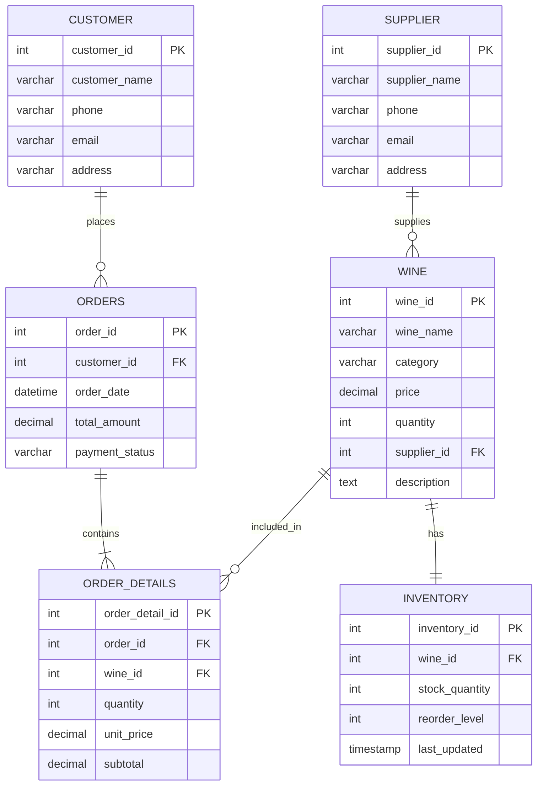

# Entity Relationship (ER) Diagram Documentation

## 1. Relational Entities & Relationships

The **Wines Management System** comprises 6 core normalized relational tables:

```
SUPPLIER 1 ----< M WINE
CUSTOMER 1 ----< M ORDERS
ORDERS   1 ----< M ORDER_DETAILS
WINE     1 ----< M ORDER_DETAILS
WINE     1 ------ 1 INVENTORY
```

---

## 2. Mermaid ER Diagram Code



---

## 3. How to Open / Import in Draw.io (diagrams.net)

1. Open [https://app.diagrams.net/](https://app.diagrams.net/) in your web browser.
2. Select **Create New Diagram** &rarr; **Blank Diagram**.
3. In the top navigation bar, click **Arrange** &rarr; **Insert** &rarr; **Advanced** &rarr; **Mermaid**.
4. Paste the Mermaid code above from `er_diagram.mmd`.
5. Click **Insert**. Draw.io will automatically layout the entities, primary keys, foreign keys, and relationship connectors.
6. Click **File** &rarr; **Export as** &rarr; **PNG / PDF** for academic project reports and presentations.

---

## 4. How to Generate ER Diagram in MySQL Workbench

1. Open **MySQL Workbench**.
2. Connect to your MySQL server (`localhost:3306`).
3. Click **Database** from the top menu &rarr; **Reverse Engineer...**
4. Select `wines_management_db`.
5. Click **Next** through the wizard and then **Execute**.
6. MySQL Workbench will render an EER (Enhanced Entity-Relationship) diagram with all foreign key cardinalities and table columns automatically.
